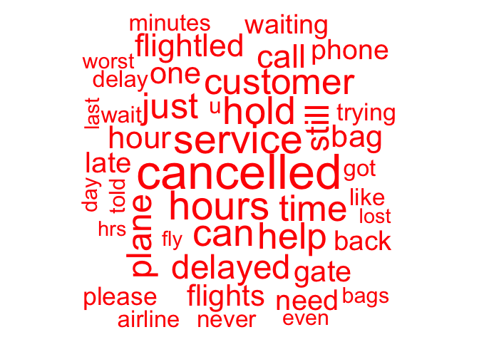
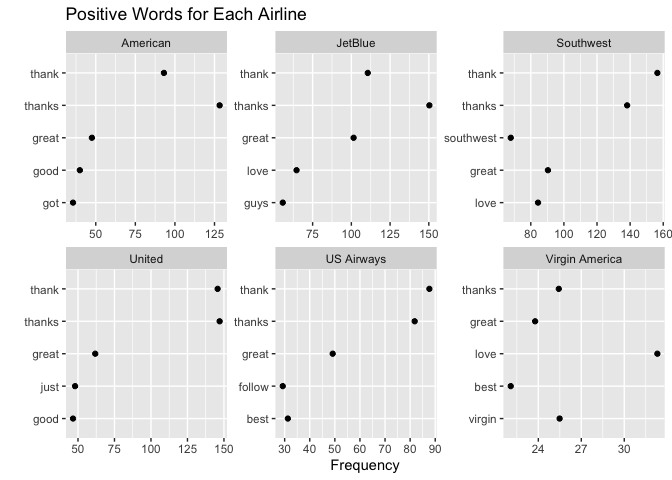
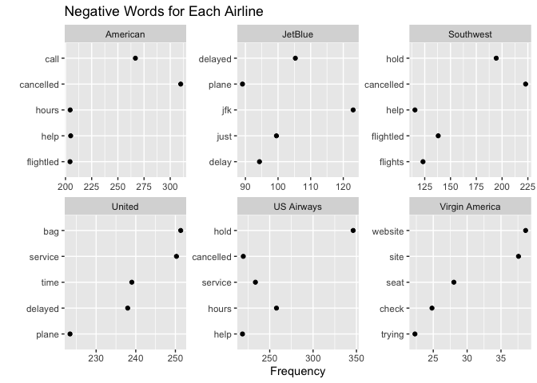
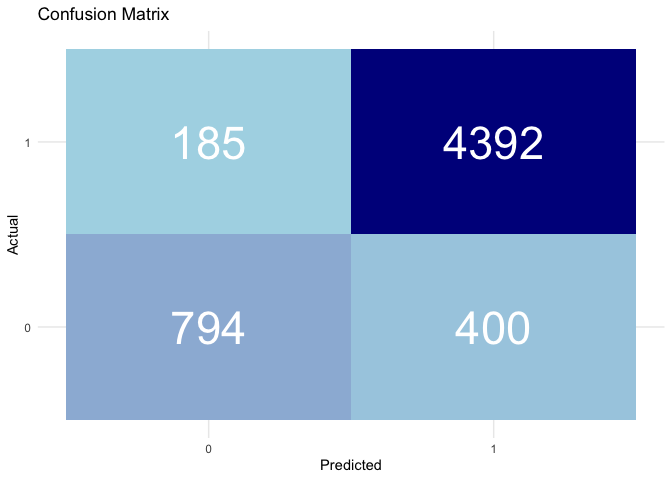

Tweet Classifier
================
Matteo Larrode

# Report on the Sentiment About Airlines Using Text Data Analysis on Tweets

## Introduction

This report analyzed more that 11,000 tweets to gauge customers’
sentiment towards the company and its major competitors. Word usage is
compared between positive and negative tweets, and across airlines.
Then, two predictive tools are built to classify them. A
dictionary-based method and one using supervised machine-learning are
compared to help the company respond better to customers in real time.

## Text preparation

Text preparation started with the removal of numbers, stopwords,
punctuation, and symbols commonly used on Twitter. Very rarely used
words were also removed to ease text data analysis. Term
Frequency–Inverse Document Frequency (TF-IDF) weighting was carried out
to help give an accurate picture of words that are most characteristic
of tweets, and diminish the importance of uninformative words. TF-IDF
weightings were carried out after the different groupings of documents
as a TF-IDF weighted document-term matrix should not be amalgamated.

``` r
#Text Preparation ----------
tweetCorpus <- corpus(tweets$text, docvars = tweets)

#turn corpus into document-term matrix; make everything lower-case, remove numbers, punctuation and stopwords; TF-IDF weighting; remove airline names
dfm_tweets0 <- tweetCorpus %>%
  tokens(remove_numbers=T,
         remove_punct=T,
         include_docvars=T,
         remove_symbols = T) %>%
  tokens_remove(stopwords("en")) %>%
  dfm(tolower=T)%>%
  dfm_tfidf()

#eliminate rare words & other words
dfm_tweets <- dfm_tweets0 %>% 
  dfm_trim(min_docfreq = 5) %>% 
  dfm_remove(c("@united", "@usairways", "@americanair", "@southwestair", "@jetblue", "@virginamerica", "flight", "amp", "aa", "get", "now", "united", "jetblue", "us"))

cat("Document-Term Matrix after pre-processing\n", 
    "Number of tweets:", dim(dfm_tweets)[1], 
    "\nNumber of words: ", dim(dfm_tweets)[2])
```

    ## Document-Term Matrix after pre-processing
    ##  Number of tweets: 11541 
    ## Number of words:  2423

## Word Usage Analysis

### Sentiment

``` r
# Get the frequency of terms in the document-term matrix
freq <- textstat_frequency(dfm_tweets, force = TRUE)
top_15_terms <- freq[1:15, 1]

cat("Top 15 most used words:\n", top_15_terms, sep = "\n")
```

    ## Top 15 most used words:
    ## 
    ## cancelled
    ## thanks
    ## service
    ## just
    ## customer
    ## can
    ## time
    ## help
    ## hours
    ## hold
    ## plane
    ## thank
    ## still
    ## delayed
    ## one

``` r
tweets <- tweets %>%
  mutate(sentiment_long = ifelse(sentiment == 0, "Positive", "Negative"))

# Compute the table of sentiment frequencies for each airline
sentiment_table <- tapply(tweets$sentiment_long, tweets$airline, table)

# Loop through each airline and print the proportion of each sentiment
for (airline in names(sentiment_table)) {
  cat("Airline:", airline, "\n")
  sentiment_count <- sentiment_table[[airline]]
  sentiment_prop <- prop.table(sentiment_count)
  print(sentiment_prop)
  cat("\n")
}
```

    ## Airline: American 
    ## 
    ##  Negative  Positive 
    ## 0.8536585 0.1463415 
    ## 
    ## Airline: JetBlue 
    ## 
    ##  Negative  Positive 
    ## 0.6370914 0.3629086 
    ## 
    ## Airline: Southwest 
    ## 
    ##  Negative  Positive 
    ## 0.6753986 0.3246014 
    ## 
    ## Airline: United 
    ## 
    ## Negative Positive 
    ##  0.84256  0.15744 
    ## 
    ## Airline: US Airways 
    ## 
    ##  Negative  Positive 
    ## 0.8937599 0.1062401 
    ## 
    ## Airline: Virgin America 
    ## 
    ##  Negative  Positive 
    ## 0.5435435 0.4564565

``` r
# Words most associated with negative & positive sentiment
bysentiment <- textstat_frequency(dfm_tweets,25,groups=sentiment, force=T) %>%
  mutate(sentiment_long = ifelse(group == 0, "Positive", "Negative"))


#Wordclouds
pos_tweets <- dfm_tweets[dfm_tweets$sentiment == "0",]
textplot_wordcloud(pos_tweets,
                   min_size = 0.5,
                   max_size=6,
                   color = "darkblue",
                   comparison=FALSE, 
                   max_words=50)
```

<!-- -->

``` r
neg_tweets <- dfm_tweets[dfm_tweets$sentiment == "1",]

textplot_wordcloud(neg_tweets,
                   min_size = 0.5,
                   max_size=6,
                   color = "red",
                   comparison=FALSE, 
                   max_words=50)
```

<!-- --> Some words
are commonly associated with a positive or negative sentiment. Words of
gratitude like “thanks” and “appreciate”, along with “awesome”, “great”
and “amazing” are found in many positive tweets. On the other hand, the
language associated to delay or cancellation (“hours”, “cancelled”,
“hold”, “delayed”, “time”) are commonly associated with negative tweets.

### Sentiment by airline

While commonly used words associated with a positive sentiment are
similar across airlines, an overview of how negative word usage differs
across airlines can help reveal specific customer complaints.

``` r
#most-used words for each airline (positive & negative)
byairline_pos <- textstat_frequency(pos_tweets, 5, groups=airline, force=TRUE)

ggplot(byairline_pos, 
       aes(x=frequency,y=reorder(feature,frequency))) +
  facet_wrap(~group, scales="free") +
  geom_point() + 
  labs(title = "Positive Words for Each Airline",
       y=" ",
       x = "Frequency")
```

<!-- -->

``` r
byairline_neg <- textstat_frequency(neg_tweets, 5, groups=airline, force=TRUE)

ggplot(byairline_neg, 
       aes(x=frequency,y=reorder(feature,frequency))) +
  facet_wrap(~group, scales="free") +
  geom_point() + 
  labs(title = "Negative Words for Each Airline",
       y=" ",
       x = "Frequency")
```

<!-- --> American
Airlines, Southwest, and US Airways customers seemed to have troubles
with cancelled flights and help service. JetBlue and United customers
mostly complain about delays. Virgin America customers seem to dislike
the website of the company. Many negative tweets associated to United
mention “bag”, hinting at problems of luggage management by the company.

## Dictionary-based classifier

A classic method to judge the sentiment of texts is to use a dictionary.
For sentiment analysis, the dictionary includes language associated with
positive and negative emotions. This list of pre-selected words can be
used to classify tweets by analyzing the proportion of words associated
with those emotions.

The customized dictionary includes fundamental words of sentiment
analysis. It also includes jargon specific to airlines to fit the
context in which the dictionary is used. The selection of words is based
on the analysis of their frequency in tweets after they were grouped by
sentiment and TF-IDF weighted.

``` r
#create dictionary
neg.words <- c("bad","worst", "terrible" , "cancelled","hold", "hours" ,"time", "delayed","gate", "phone") 
pos.words <- c("thanks", "thank", "great", "love", "awesome","much", "good", "best", "appreciate", "amazing")

dico <- dictionary(list(negative = neg.words, positive = pos.words))

#get sentiment score
sentiment_dico <- dfm_lookup(dfm_tweets,dictionary=dico)
sentiment_dico <- convert(sentiment_dico,to="data.frame")

cat("Most negative Tweet: ", tweets$text[which.max(sentiment_dico$negative)],
    "\n\nMost positive Tweet: ", tweets$text[which.max(sentiment_dico$positive)])
```

    ## Most negative Tweet:  @united is the worst. Worst reservation policies. Worst costumer service. Worst worst worst. Congrats, @Delta you're not that bad! 
    ## 
    ## Most positive Tweet:  @SouthwestAir I love this airline so much! Thanks so much! The service is great! The snacks are amazing! Everything is outstanding thanks!!

``` r
#classify the tweets
sentiment_dico$score <- ifelse((sentiment_dico$positive - sentiment_dico$negative)>0,0,1)
```

Let’s check the performance of the dictionary classifier!

``` r
# Create the confusion matrix
confusion_matrix <- table(sentiment_dico$score, tweets$sentiment)

# Convert the confusion matrix to a data frame
confusion_df <- as.data.frame.matrix(confusion_matrix)

confusion_df <- confusion_df %>%
  #convert row names to a new column
  rownames_to_column(var = "Predicted") %>%
  #convert column names to a new row
  pivot_longer(cols = -Predicted, names_to = "Actual", values_to = "Frequency") 

# Convert factor levels to character
confusion_df$Predicted <- as.character(confusion_df$Predicted)
confusion_df$Actual <- as.character(confusion_df$Actual)

#create heatmap
heatmap <- ggplot(data = confusion_df, aes(x = Predicted, y = Actual, fill = Frequency, label = Frequency)) +
  geom_tile() +
  geom_text(size = 12, color = "white") +
  labs(title = "Confusion Matrix", x = "Predicted", y = "Actual", fill = "Frequency") +
  theme_minimal() +
  scale_fill_gradient(low = "lightblue", high = "darkblue") +
  guides(fill = "none")


heatmap
```

<!-- -->

``` r
# Calculate the accuracy
correct_predictions <- sum(diag(confusion_matrix))
total_samples <- sum(confusion_matrix)
accuracy <- correct_predictions / total_samples

# Print the accuracy
cat("Accuracy:", round(accuracy * 100, 2), "%\n")
```

    ## Accuracy: 86.21 %

## Lasso logit classifier

Lasso (Least Absolute Selection and Shrinkage Operator) is effective for
feature selection by minimizing squared errors with a penalty for
complexity. Cross-validation in a training set selected the optimal
logit lasso model, which was then used to classify tweets in the test
set. This classifier is based on a supervised machine- learning
technique whereby the model ‘learns’ which words predicts the sentiment
embedded in tweets.

``` r
#Lasso Logit Classifier --------

#create matrix by binding the sentiment column from the tweets with the document-term matrix
dfm_tweets_mod <- as.matrix(cbind(tweets$sentiment, dfm_tweets))

#generate vector of random row indices for cross-validation (without replacement)
cv.rows <- sample(nrow(dfm_tweets_mod),(nrow(dfm_tweets_mod)/2))
cv.data <- dfm_tweets_mod[cv.rows,] #training data
test.data <- dfm_tweets_mod[-cv.rows,] #test data

#cross-validation for the lasso logit classifier 
#performance measure is classification accuracy (type.measure="class")
lasso.tweets <- cv.glmnet(x=cv.data[,2:ncol(dfm_tweets_mod)],y=cv.data[,1],
                          family="binomial",type.measure="class")

#classify test set
tweets.preds <- predict(lasso.tweets,test.data[,2:ncol(dfm_tweets_mod)],type='class')
```

Using the coefficients of the lasso logit model, we can determine the
words that most strongly predict negative or positive sentiment in the
classifier.

``` r
#extract coefficients of the lasso logit model
#subset coefficients by selecting only the rows where the coefficient values are not equal to zero, as the lasso regularization can set some coefficients to exactly zero.
lasso.coeffs <- as.matrix(coef(lasso.tweets)[coef(lasso.tweets)[,1]!=0,])

#subset matrix by ordering it based on the values of the coefficients
lasso.coeffs <- as.matrix(lasso.coeffs[order(lasso.coeffs[,1],decreasing = T),])
```

Words that has the most weight on predicting negative tweets were:

``` r
lasso.coeffs[2:10,]
```

    ##    forget     hours cancelled     worst   ruining   nothing      hold   delayed 
    ## 1.4863394 1.2009143 0.9955352 0.9265050 0.8863705 0.8340502 0.7757220 0.7746149 
    ##       key 
    ## 0.7464204

On the other hand, words that were the most likely to be in a positive
tweet were:

``` r
print(lasso.coeffs[(nrow(lasso.coeffs)-10):nrow(lasso.coeffs),])
```

    ## @love_dragonss        worries           best      excellent           rock 
    ##     -0.9950645     -1.0176103     -1.0703936     -1.0820639     -1.0964683 
    ##        awesome        amazing           love          great          thank 
    ##     -1.1639482     -1.2187431     -1.3252037     -1.4280825     -2.3698212 
    ##         thanks 
    ##     -2.3991331

Finally let’s check the performance of this model, and compare it to the
dictionary.

``` r
# Create the confusion matrix
confusion_matrix2 <- table(tweets.preds,test.data[,1])


# Convert the confusion matrix to a data frame
confusion_df2 <- as.data.frame.matrix(confusion_matrix2)

confusion_df2 <- confusion_df2 %>%
  #convert row names to a new column
  rownames_to_column(var = "Predicted") %>%
  #convert column names to a new row
  pivot_longer(cols = -Predicted, names_to = "Actual", values_to = "Frequency") 

# Convert factor levels to character
confusion_df2$Predicted <- as.character(confusion_df2$Predicted)
confusion_df2$Actual <- as.character(confusion_df2$Actual)

#create heatmap
heatmap2 <- ggplot(data = confusion_df2, aes(x = Predicted, y = Actual, fill = Frequency, label = Frequency)) +
  geom_tile() +
  geom_text(size = 12, color = "white") +
  labs(title = "Confusion Matrix", x = "Predicted", y = "Actual", fill = "Frequency") +
  theme_minimal() +
  scale_fill_gradient(low = "lightblue", high = "darkblue") +
  guides(fill = "none")


heatmap2
```

<!-- -->

``` r
# Calculate the accuracy
correct_predictions <- sum(diag(confusion_matrix2))
total_samples <- sum(confusion_matrix2)
accuracy <- correct_predictions / total_samples

# Print the accuracy
cat("Accuracy:", round(accuracy * 100, 2), "%\n")
```

    ## Accuracy: 89.86 %

Both classifiers display outstanding sensitivity rates, indicating great
efficacy at identifying tweets expressing a negative sentiment. Their
lower specificity uncovers a weaker accuracy in identifying positive
tweets for both classifiers. Remarkably, the classifier based on
supervised machine-learning outperforms its dictionary-based counterpart
with a lower error rate, and better sensitivity and specificity.

The poorer quality of the dictionary-based classifier can be explained
by multiple factors. Dictionary-based methods are limited by the
difficulty to turn word proportions into a single measure. Also, the
threshold at which a text is classified as positive or negative is
unclear and subject to subjectivity. Finally, the greatest limitation of
this method is in the dictionary itself. Context-specific dictionaries
are laborious to build and the 20 words of the dictionary used in this
report cannot capture accurately the sentiment of a diversity of
customers. On the other hand, supervised learning, i.e., classification
with a regularized logit model is better equipped to handle vast size of
text data and is more reliable, thanks to its optimal feature selection.
In fact, this technique based on machine-learning can be thought of as
an improvement of the dictionary method, where the computer would first
‘learn’ the dictionary.

## Conclusion

Despite its limitations, including the large cost and subjectivity of
the necessary pre-labelling of many tweets to supervise the model, using
the classifier based on the lasso logit method should be favoured by the
company to classify future tweets.
