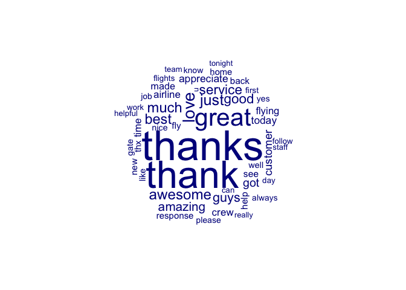
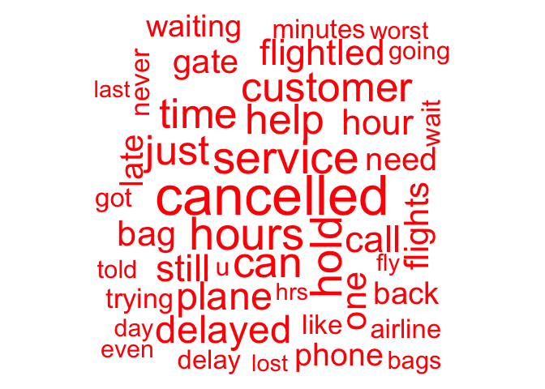

Tweet Classifier
================
Matteo Larrode

# Report on the Sentiment About Airlines Using Text Data Analysis on Tweets

## Introduction

This report analyzed more that 11,000 tweets to gauge customers’
sentiment towards the company and its major competitors. Word usage is
compared between positive and negative tweets, and across airlines.
Then, two predictive tools are built to classify them. A
dictionary-based method and one using supervised machine-learning are
compared to help the company respond better to customers in real time.

## Text preparation

Text preparation started with the removal of numbers, stopwords,
punctuation, and symbols commonly used on Twitter. Very rarely used
words were also removed to ease text data analysis. Term
Frequency–Inverse Document Frequency (TF-IDF) weighting was carried out
to help give an accurate picture of words that are most characteristic
of tweets, and diminish the importance of uninformative words. TF-IDF
weightings were carried out after the different groupings of documents
as a TF-IDF weighted document-term matrix should not be amalgamated.

``` r
#Text Preparation ----------
tweetCorpus <- corpus(tweets$text, docvars = tweets)

#turn corpus into document-term matrix; make everything lower-case, remove numbers, punctuation and stopwords; TF-IDF weighting; remove airline names
dfm_tweets0 <- tweetCorpus %>%
  tokens(remove_numbers=T,
         remove_punct=T,
         include_docvars=T,
         remove_symbols = T) %>%
  tokens_remove(stopwords("en")) %>%
  dfm(tolower=T)%>%
  dfm_tfidf()

#eliminate rare words & other words
dfm_tweets <- dfm_tweets0 %>% 
  dfm_trim(min_docfreq = 5) %>% 
  dfm_remove(c("@united", "@usairways", "@americanair", "@southwestair", "@jetblue", "@virginamerica", "flight", "amp", "aa", "get", "now", "united", "jetblue", "us"))

cat("Document-Term Matrix after pre-processing\n", 
    "Number of tweets:", dim(dfm_tweets)[1], 
    "\nNumber of words: ", dim(dfm_tweets)[2])
```

    ## Document-Term Matrix after pre-processing
    ##  Number of tweets: 11541 
    ## Number of words:  2423

## Word Usage Analysis

### Sentiment

``` r
# Get the frequency of terms in the document-term matrix
freq <- textstat_frequency(dfm_tweets, force = TRUE)
top_15_terms <- freq[1:15, 1]

cat("Top 15 most used words:\n", top_15_terms, sep = "\n")
```

    ## Top 15 most used words:
    ## 
    ## cancelled
    ## thanks
    ## service
    ## just
    ## customer
    ## can
    ## time
    ## help
    ## hours
    ## hold
    ## plane
    ## thank
    ## still
    ## delayed
    ## one

``` r
tweets <- tweets %>%
  mutate(sentiment_long = ifelse(sentiment == 0, "Positive", "Negative"))

# Compute the table of sentiment frequencies for each airline
sentiment_table <- tapply(tweets$sentiment_long, tweets$airline, table)

# Loop through each airline and print the proportion of each sentiment
for (airline in names(sentiment_table)) {
  cat("Airline:", airline, "\n")
  sentiment_count <- sentiment_table[[airline]]
  sentiment_prop <- prop.table(sentiment_count)
  print(sentiment_prop)
  cat("\n")
}
```

    ## Airline: American 
    ## 
    ##  Negative  Positive 
    ## 0.8536585 0.1463415 
    ## 
    ## Airline: JetBlue 
    ## 
    ##  Negative  Positive 
    ## 0.6370914 0.3629086 
    ## 
    ## Airline: Southwest 
    ## 
    ##  Negative  Positive 
    ## 0.6753986 0.3246014 
    ## 
    ## Airline: United 
    ## 
    ## Negative Positive 
    ##  0.84256  0.15744 
    ## 
    ## Airline: US Airways 
    ## 
    ##  Negative  Positive 
    ## 0.8937599 0.1062401 
    ## 
    ## Airline: Virgin America 
    ## 
    ##  Negative  Positive 
    ## 0.5435435 0.4564565

``` r
# Words most associated with negative & positive sentiment
bysentiment <- textstat_frequency(dfm_tweets,25,groups=sentiment, force=T) %>%
  mutate(sentiment_long = ifelse(group == 0, "Positive", "Negative"))


#Wordclouds
pos_tweets <- dfm_tweets[dfm_tweets$sentiment == "0",]
textplot_wordcloud(pos_tweets,
                   min_size = 0.5,
                   max_size=6,
                   color = "darkblue",
                   comparison=FALSE, 
                   max_words=50)
```

<!-- -->

``` r
pos_tweets
```

    ## Document-feature matrix of: 2,363 documents, 2,423 features (99.77% sparse) and 3 docvars.
    ##         features
    ## docs     error w preferred status able reach agent via phone travel
    ##   text5      0 0         0      0    0     0     0   0     0      0
    ##   text8      0 0         0      0    0     0     0   0     0      0
    ##   text17     0 0         0      0    0     0     0   0     0      0
    ##   text18     0 0         0      0    0     0     0   0     0      0
    ##   text19     0 0         0      0    0     0     0   0     0      0
    ##   text26     0 0         0      0    0     0     0   0     0      0
    ## [ reached max_ndoc ... 2,357 more documents, reached max_nfeat ... 2,413 more features ]

``` r
neg_tweets <- dfm_tweets[dfm_tweets$sentiment == "1",]
textplot_wordcloud(neg_tweets,
                   min_size = 0.5,
                   max_size=6,
                   color = "red",
                   comparison=FALSE, 
                   max_words=50)
```

<!-- -->

``` r
neg_tweets
```

    ## Document-feature matrix of: 9,178 documents, 2,423 features (99.68% sparse) and 3 docvars.
    ##        features
    ## docs       error        w preferred   status     able    reach    agent
    ##   text1 2.399486 1.729805  2.806971 2.175753 2.071017 2.399486 1.669546
    ##   text2 0        0         0        0        0        0        0       
    ##   text3 0        0         0        0        0        0        0       
    ##   text4 0        0         0        0        0        0        0       
    ##   text6 0        0         0        0        0        0        0       
    ##   text7 0        1.729805  0        0        0        0        0       
    ##        features
    ## docs         via    phone   travel
    ##   text1 2.236169 1.484752 1.863586
    ##   text2 0        0        0       
    ##   text3 0        0        0       
    ##   text4 0        0        0       
    ##   text6 0        0        0       
    ##   text7 0        0        0       
    ## [ reached max_ndoc ... 9,172 more documents, reached max_nfeat ... 2,413 more features ]

Some words are commonly associated with a positive or negative
sentiment. Words of gratitude like “thanks” and “appreciate”, along with
“awesome”, “great” and “amazing” are found in many positive tweets. On
the other hand, the language associated to delay or cancellation
(“hours”, “cancelled”, “hold”, “delayed”, “time”) are commonly
associated with negative tweets.

### Sentiment by airline

While commonly used words associated with a positive sentiment are
similar across airlines, an overview of how negative word usage differs
across airlines can help reveal specific customer complaints. For
example, American Airlines, Southwest, and US Airways customers seemed
to have troubles with cancelled flights and help service. JetBlue and
United customers mostly complain about delays. Virgin America customers
seem to dislike the website of the company. Many negative tweets
associated to United mention “bag”, hinting at problems of luggage
management by the company.
